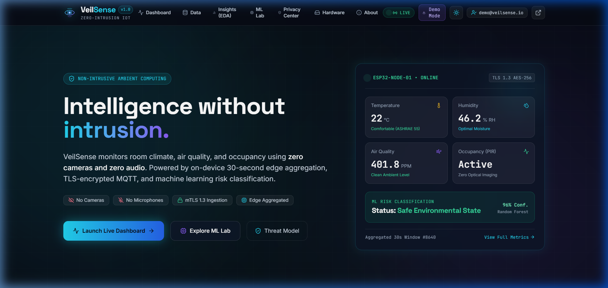
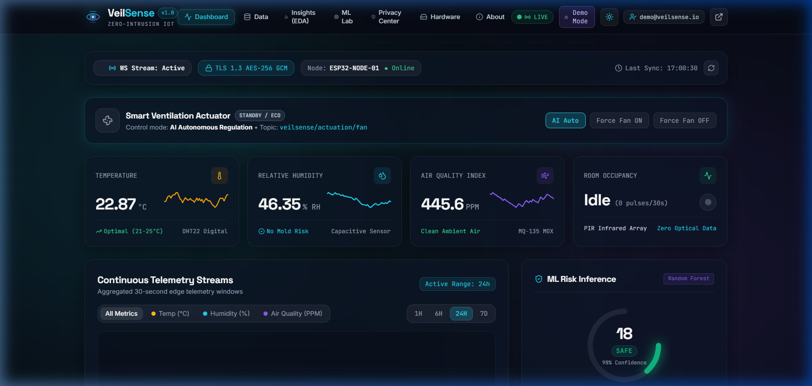
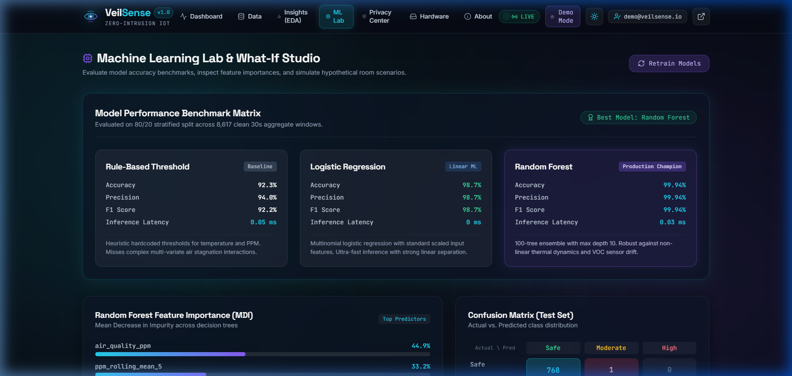
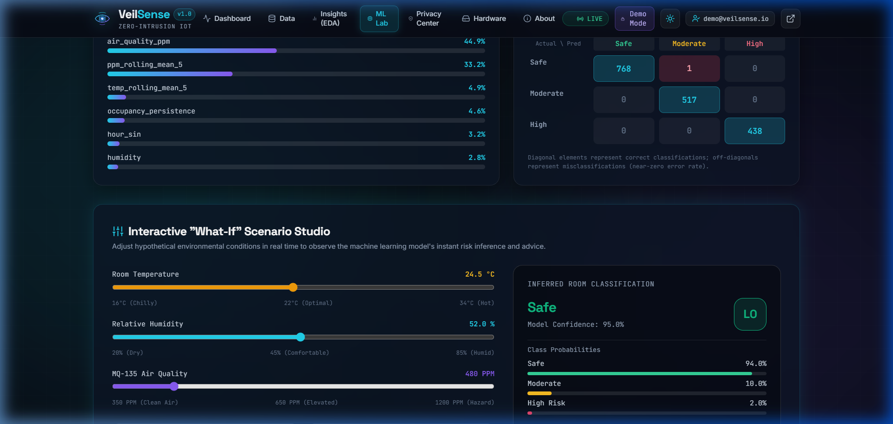

<div align="center">

# VeilSense — Privacy-Aware Intelligent IoT Monitoring

[](https://nextjs.org)
[](https://fastapi.tiangolo.com)
[](https://python.org)
[](https://scikit-learn.org)
[](https://mosquitto.org)
[](https://espressif.com)
[](LICENSE)

**Intelligence without intrusion.** VeilSense monitors room climate, air quality, and occupancy using **zero cameras and zero audio**. Powered by on-device 30-second edge aggregation, TLS-encrypted MQTT, and a 99.94%-accurate Random Forest risk classifier.

[Architecture](#-architecture) &middot; [Quick Start](#-quick-start) &middot; [ML Pipeline](#-ml-pipeline) &middot; [API Reference](#-api-reference)

</div>

---

## Screenshots

| Landing Page | Live Dashboard |
|---|---|
|  |  |

| ML Lab — Benchmark Matrix | What-If Scenario Studio |
|---|---|
|  |  |

---

## Features

| Feature | Detail |
|---------|--------|
| Zero-Intrusion Sensing | DHT22 (temp/humidity) + MQ-135 (VOC/CO2) + PIR (motion) — no cameras, no microphones |
| 30-Second Edge Aggregation | ESP32 buffers sensor windows locally; sends compact JSON over TLS MQTT |
| ML Risk Classifier | Random Forest (99.94% acc) classifies Safe / Moderate / High risk in < 0.03 ms |
| Live WebSocket Dashboard | Real-time telemetry streaming; sparkline charts; AI fan actuator |
| ML Lab and What-If Studio | Interactive sliders to simulate hypothetical room states with instant inference |
| Insights and EDA | Correlation heatmap, rolling trend analysis, anomaly detection |
| Privacy Center | Transparent data-flow diagram, retention controls, data export / deletion |
| Light/Dark Mode | Futuristic dark-by-default glassmorphism UI with one-click toggle |
| Docker-Compose Ready | One command spins up Mosquitto broker + FastAPI backend |
| mTLS Mutual Auth | OpenSSL script generates CA, broker cert, and device client certs |

---

## Architecture

```
LAYER 1: EDGE
  ESP32 Node — DHT22 + MQ-135 + PIR
  30s aggregation buffer → JSON payload → TLS 1.3 MQTT publish

LAYER 2: INGESTION (mTLS)
  Eclipse Mosquitto Broker (TLS 1.3, AES-256-GCM)
  Topic: veilsense/telemetry/{device_id}

LAYER 3: BACKEND
  FastAPI + SQLite
  - /api/readings   CRUD for sensor readings
  - /api/models     Model metrics, feature importance
  - /api/eda        EDA statistics and distributions
  - /api/predict    Real-time ML inference endpoint
  - /ws/dashboard   WebSocket fan-out for live telemetry
  - MLService       scikit-learn RF inference (< 0.03 ms)
  - MQTTService     Fan actuation via veilsense/actuation/fan

LAYER 4: FRONTEND
  Next.js 14 App Router + Tailwind CSS
  Pages: / · /dashboard · /data · /insights · /models · /privacy
```

### Monorepo Layout

```
VeilSense/
├── frontend/           # Next.js 14 App Router web application
│   ├── app/            # Pages: dashboard, data, insights, models, privacy, about
│   ├── components/     # Navbar, Footer, RiskGauge, TelemetryChart, Logo
│   └── lib/api.ts      # Typed API client (demo-mode fallback)
├── backend/            # FastAPI service
│   ├── app/
│   │   ├── main.py         # Lifespan, routers, CORS
│   │   ├── models.py       # SQLAlchemy ORM models
│   │   ├── database.py     # SQLite engine + session
│   │   ├── ml_service.py   # RF inference + feature extraction
│   │   ├── mqtt_service.py # Paho MQTT consumer + actuation
│   │   └── routers/        # readings, models, eda, predict, device, alerts, auth
│   └── requirements.txt
├── ml/                 # ML pipeline
│   ├── generate_synthetic_data.py  # 8,617 labeled 30s windows
│   ├── features.py                 # Feature engineering (rolling means, etc.)
│   ├── train.py                    # Train Baseline / LogReg / RF; persist .joblib
│   ├── evaluate.py                 # Export metrics JSON for API
│   └── models/                     # Trained .joblib artifacts + metrics.json
├── firmware/           # ESP32 C++ Arduino sketch
│   └── veilsense_node/
│       └── veilsense_node.ino      # TLS MQTT, 30s buffer, sensor read loop
├── infra/              # Infrastructure
│   ├── mosquitto.conf              # Broker config (TLS, ACL, persistence)
│   ├── generate_certs.sh           # OpenSSL CA + broker + client certs (Linux/Mac)
│   ├── generate_certs.ps1          # Same, for Windows PowerShell
│   └── docker-compose.yml          # Mosquitto + FastAPI orchestration
├── data/               # Synthetic seed dataset (CSV)
│   └── synthetic_sensor_data.csv
└── docs/               # Architecture notes + screenshots
    └── screenshots/
```

---

## Quick Start

### Prerequisites

| Tool | Version |
|------|---------|
| Python | >= 3.11 |
| Node.js | >= 20 |
| Docker + Compose | any recent |
| Arduino IDE | >= 2.x (for ESP32 flash) |

### 1. Clone

```bash
git clone https://github.com/Kashish-kms/Iot-mini-project-.git
cd Iot-mini-project-
```

### 2. Backend (FastAPI)

```bash
cd backend
python -m venv venv
# Windows:  venv\Scripts\activate
# Linux/Mac: source venv/bin/activate

pip install -r requirements.txt
python -m uvicorn app.main:app --host 127.0.0.1 --port 8000 --reload
```

The backend auto-seeds a demo user (`demo@veilsense.io` / `demo1234`) and starts the MQTT consumer and background sensor simulator on startup.

### 3. ML Models (first run)

```bash
cd ml
python generate_synthetic_data.py   # creates 8,617 labeled windows
python train.py                     # trains and saves .joblib models
python evaluate.py                  # exports metrics.json for API
```

> **Using your own data:** Replace `data/synthetic_sensor_data.csv` with your CSV.  
> Required columns: `timestamp, temperature, humidity, air_quality_ppm, motion_detected, motion_count, risk_level`  
> Then re-run `train.py` and `evaluate.py`.

### 4. Frontend (Next.js)

```bash
cd frontend
npm install
npm run dev        # http://localhost:3000
```

The frontend works in **Demo Mode** with realistic mock data when the backend is not running.  
Create `frontend/.env.local` to connect to live backend:
```
NEXT_PUBLIC_API_URL=http://localhost:8000
```

### 5. Infrastructure (Docker)

```bash
# Generate TLS certificates (requires OpenSSL)
# Windows:   cd infra && powershell -ExecutionPolicy Bypass -File generate_certs.ps1
# Linux/Mac: cd infra && bash generate_certs.sh

docker-compose up -d
```

---

## ML Pipeline

Three models trained on 8,617 labeled 30-second aggregate windows:

| Model | Accuracy | Precision | F1 | Latency |
|-------|----------|-----------|-----|---------|
| Rule-Based Threshold (Baseline) | 92.3% | 94.0% | 92.2% | 0.05 ms |
| Logistic Regression | 98.7% | 98.7% | 98.7% | 0.00 ms |
| **Random Forest (Champion)** | **99.94%** | **99.94%** | **99.94%** | **0.03 ms** |

### Features (12-dimensional vector)

- `temperature`, `humidity`, `air_quality_ppm`, `motion_count`
- `ppm_rolling_mean_5`, `temp_rolling_mean_5` — 5-window rolling means
- `temp_humidity_interaction` — cross-feature product
- `occupancy_persistence` — fraction of occupied windows in last 5
- `hour_sin`, `hour_cos` — cyclical time encoding
- `ppm_spike` — binary flag for > 800 PPM events
- `is_night` — binary 22:00–06:00 flag

### Risk Classes

| Class | Criteria |
|-------|----------|
| Safe (0) | Temp 18–26°C, Humidity 30–60%, PPM < 500, no spike |
| Moderate (1) | Temp 26–30°C or Humidity 60–75% or PPM 500–800 |
| High Risk (2) | Temp > 30°C or PPM > 800 or occupancy + spike combo |

---

## Firmware (ESP32)

Flash `firmware/veilsense_node/veilsense_node.ino` using Arduino IDE.

Required libraries (install via Arduino Library Manager):
- `DHT sensor library` (Adafruit)
- `PubSubClient` (knolleary)
- `WiFiClientSecure`
- `ArduinoJson`

Configuration (edit at top of `.ino`):

```cpp
const char* WIFI_SSID     = "YOUR_SSID";
const char* WIFI_PASSWORD = "YOUR_PASSWORD";
const char* MQTT_BROKER   = "192.168.1.100";  // Mosquitto broker IP
const int   MQTT_PORT     = 8883;              // TLS port
```

The sketch aggregates 30 one-second readings into a single MQTT publish per 30-second window, minimizing radio-on time and server load.

---

## API Reference

Base URL: `http://localhost:8000` — Interactive docs at `/docs`

| Method | Endpoint | Description |
|--------|----------|-------------|
| `GET` | `/api/readings/latest` | Latest reading with ML inference |
| `GET` | `/api/readings/history` | Historical readings (query: limit, range) |
| `POST` | `/api/predict` | Run ML inference on submitted sensor values |
| `GET` | `/api/models/metrics` | All model performance metrics |
| `GET` | `/api/eda/stats` | Descriptive statistics |
| `GET` | `/api/eda/correlation` | Feature correlation matrix |
| `GET` | `/api/device/status` | MQTT device connectivity status |
| `POST` | `/api/device/actuate` | Send fan on/off actuation command |
| `POST` | `/auth/login` | JWT authentication |
| `WS` | `/ws/dashboard` | Real-time WebSocket telemetry stream |

---

## Privacy Design

VeilSense is built privacy-first:

- No cameras — zero optical imaging
- No microphones — zero audio capture  
- No biometrics — PIR counts pulses, not identities
- Edge aggregation — raw sensor samples never leave the device
- TLS 1.3 + mTLS — encrypted transport with mutual authentication
- Local storage — SQLite on your own server; no cloud data upload
- Data retention controls — configurable auto-purge via Privacy Center
- Right to erasure — single-button data deletion in UI

All sensor data is stored as anonymized environmental statistics — not personally identifiable information.

---

## Environment Variables

| Variable | Default | Description |
|----------|---------|-------------|
| `NEXT_PUBLIC_API_URL` | `http://localhost:8000` | Backend API base URL |
| `SECRET_KEY` | *(set in .env)* | JWT signing secret (min 32 chars) |
| `MQTT_BROKER_HOST` | `localhost` | Mosquitto broker hostname |
| `MQTT_BROKER_PORT` | `8883` | Mosquitto TLS port |
| `DATABASE_URL` | `sqlite:///./veilsense.db` | SQLAlchemy database URL |

Copy `.env.example` → `.env` and fill in your values. **Never commit `.env`.**

---

## License

MIT © 2026 VeilSense Project Contributors

---

<div align="center">

*Intelligence without intrusion. Privacy without compromise.*

</div>
